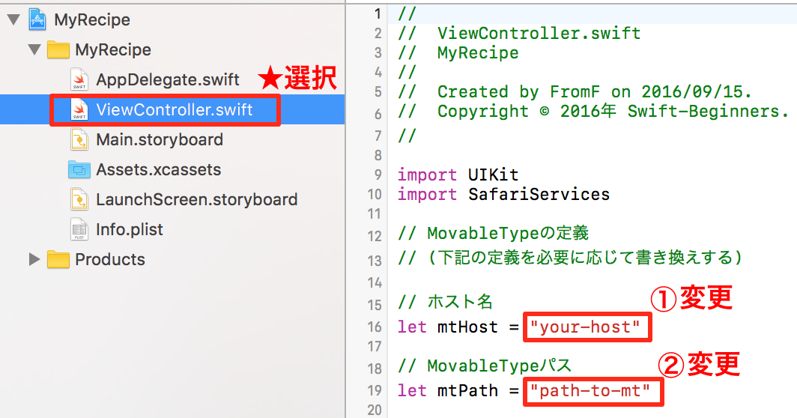
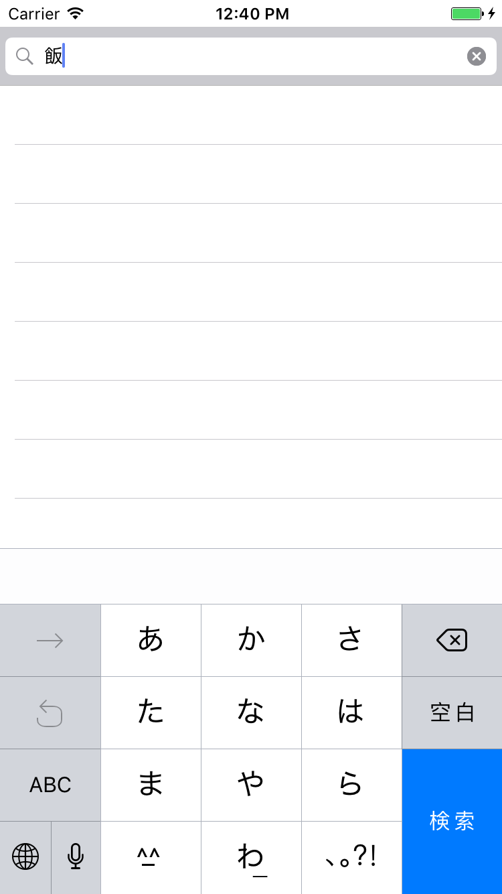
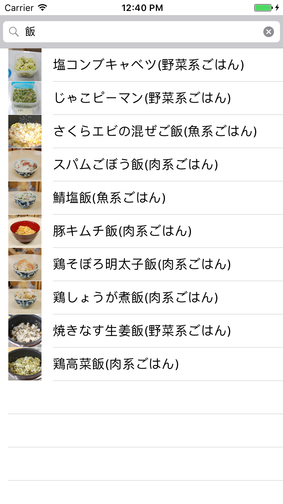

# Movable Type Data API v3のSearch利用したSwift3.0アプリ
## はじめに  
これは、[MTDDC Meetup TOKYO 2016](http://mtddc2016.mt-tokyo.net/)の登壇するために作成したSwift3.0利用したiOSアプリです。  

  

## 動作環境
* [Movable Type Data API v3](https://www.movabletype.jp/developers/data-api/)が利用できるサイト
* Xcode8.0以降(Swft3.0)
* iOS10以降がインストールされたiOSデバイス（iPad含む)

## 使い方

### Step1.ホストとMovableType配置場所をソースコードを編集する
  

### Step2.アプリを起動し検索バーに検索キーワードを入力する
  

### Step3.キーボードの検索をタップする
Movable Type DataAPIを使い検索結果が一覧表示されます。  
  

### Step4.一覧からタップすると掲載サイトがアプリ内ブラウザが起動し表示される
Movable Type DataAPIから取得したpermalinkのサイトが表示されます。  
  

## これからつくるiPhoneアプリ開発入門 ~Swiftではじめるプログラミングの第一歩~
おすすめSwift 3.0向け入門書です。  
本ソースコードもこちらの書籍のお菓子検索アプリから応用しています。  
[公式サイト](https://swiftbg.github.io/swiftbook/)  
